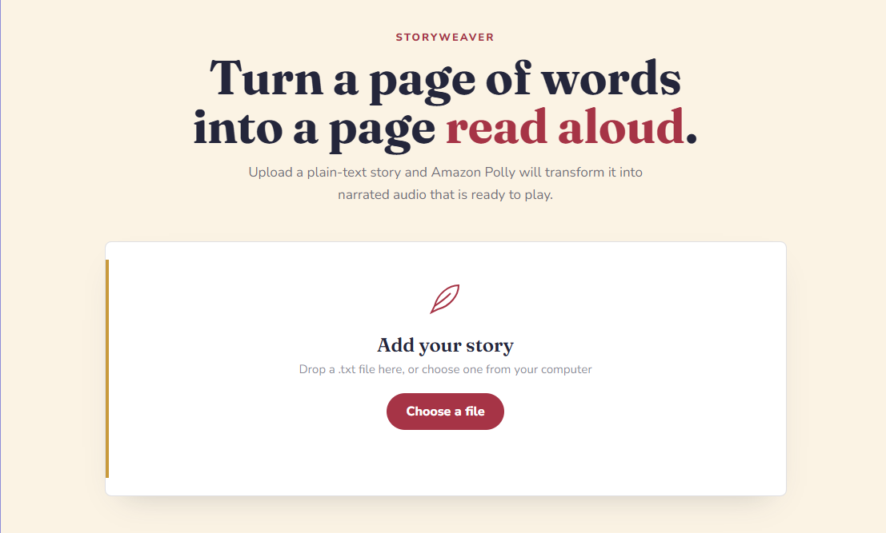
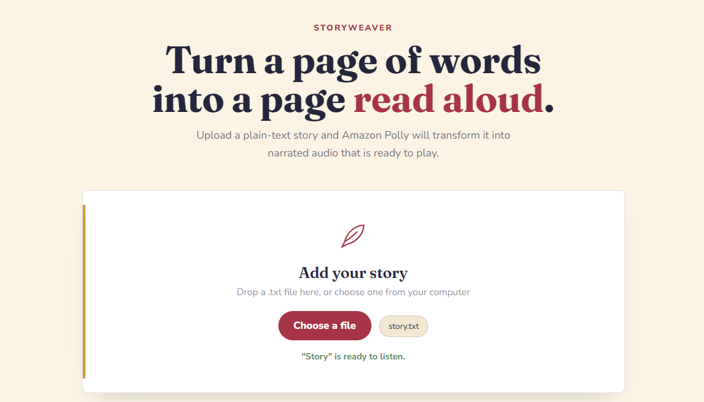
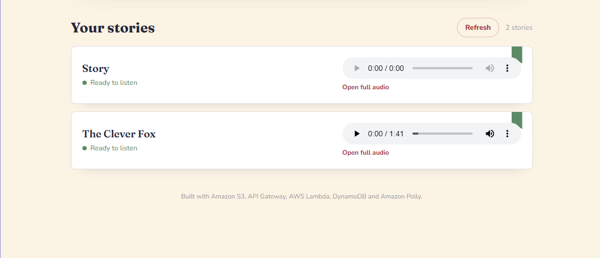
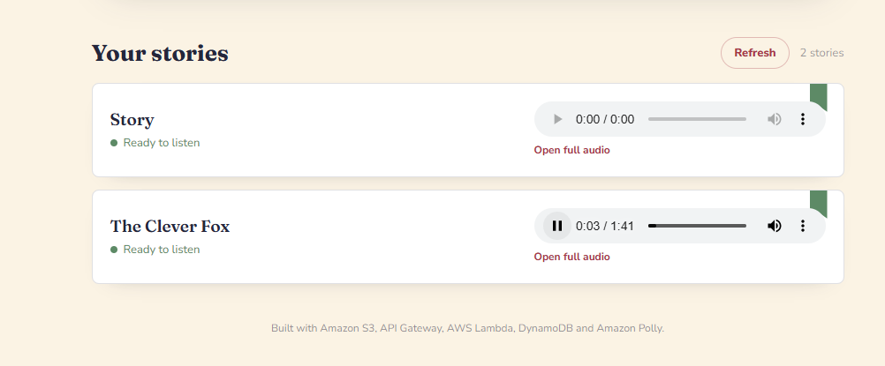

# AWS Kids Storytelling App

A serverless storytelling application that converts children’s stories into speech using **Amazon Polly**.

Users can enter a story, generate MP3 narration, view completed stories, and play the generated audio directly from the website.

## Live Demo

[Open AWS Kids Storytelling App](https://yadnesh-09.github.io/aws-kids-storytelling-app/)

## Features

- Enter and upload children’s stories
- Convert story text into speech
- Generate MP3 audio using Amazon Polly
- Store generated audio files in Amazon S3
- Store story information in Amazon DynamoDB
- Display generated stories on the website
- Play generated audio directly in the browser
- Responsive website interface
- Serverless AWS architecture
- Frontend hosted using GitHub Pages

## AWS Services Used

- **Amazon API Gateway** — provides backend API endpoints
- **AWS Lambda** — processes story requests
- **Amazon Polly** — converts story text into speech
- **Amazon S3** — stores generated MP3 files
- **Amazon DynamoDB** — stores story information and processing status
- **AWS IAM** — controls permissions between AWS services
- **Amazon CloudWatch** — stores Lambda logs and errors

## Architecture

```text
User Browser
     |
     v
GitHub Pages Frontend
     |
     v
Amazon API Gateway
     |
     v
AWS Lambda
     |
     +----------------------+
     |                      |
     v                      v
Amazon Polly          Amazon DynamoDB
Text-to-Speech        Story Metadata
     |
     v
Amazon S3
Generated MP3 Audio
     |
     v
Website Audio Player
```

## How the Application Works

1. The user enters a story title and story text.
2. The website sends the story to Amazon API Gateway.
3. API Gateway invokes the AWS Lambda function.
4. Lambda validates and processes the story.
5. Amazon Polly converts the story into speech.
6. The generated MP3 audio is stored in Amazon S3.
7. Story information is stored in Amazon DynamoDB.
8. The website retrieves the completed stories.
9. The user can play the generated audio from the website.

## Project Structure

```text
kids-story-app/
├── index.html
├── style.css
├── script.js
├── screenshots/
│   ├── 01-storytelling-home.png
│   ├── 02-story-upload-form.png
│   ├── 03-generated-story-list.png
│   └── 04-story-audio-player.png
├── README.md
└── .gitignore
```

## Application Screenshots

### Application Home Page



### Story Upload Form



### Generated Story List



### Story Audio Player



## Run Locally

Open PowerShell inside the project folder:

```powershell
cd "C:\Users\ASUS\OneDrive\Desktop\AWS_Prog\kids-story-app"
```

Start the local website server:

```powershell
py -m http.server 5500
```

Open the website:

```text
http://localhost:5500
```

## API Functions

The backend performs the following tasks:

- Receives story title and story text
- Generates speech using Amazon Polly
- Stores MP3 files in Amazon S3
- Saves story metadata in DynamoDB
- Returns completed stories to the frontend
- Provides audio URLs for playback

## Security

- AWS credentials are not stored in the frontend
- Lambda uses an IAM execution role
- S3 access is controlled through AWS permissions
- API Gateway controls access to the backend
- CloudWatch is used for logging and troubleshooting

## Future Improvements

- User authentication using Amazon Cognito
- Multiple Amazon Polly voices
- Language selection
- Story categories
- Audio download option
- Story deletion option
- AI-generated stories
- Voice speed controls
- CloudFront delivery for generated audio

## Author

**Yadnesh Patil**

- GitHub: [Yadnesh-09](https://github.com/Yadnesh-09)
- Portfolio: [yadnesh-09.github.io](https://yadnesh-09.github.io/)
